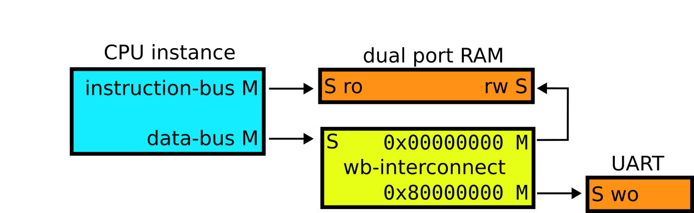

# Toy SoC with different drop-in compatible CPUs 

This is a small SoC to play around with firmware and different RISC-V CPUs.
The layout of the SoC looks like this.

Before running the testbench (`make`) git submodules must be enabled (`git submodule init; git submodule update`).
All CPUs are wrapped with a [wishbone](https://cdn.opencores.org/downloads/wbspec_b4.pdf) interface to make them drop-in compatible.

## CPU selection

  - [uRV](https://ohwr.org/project/urv-core): the most performant available CPU, bus also the largest
  - [picorv32](https://github.com/YosysHQ/picorv32): smaller than uRV but also less performant, but has higher f_max
  - [serv](https://github.com/olofk/serv) with MDU: even smaller but ~10x slower than picorv32

  The CPU selection happens in `testbench.vhd` by selecting the type of the `cpu` instance. Just uncomment the one you want.

## Firmware

  The firmware [based on this code](https://crypto.stanford.edu/pbc/notes/pi/code.html) calculates the first 800 digits of PI and writes the output into a file `cpu_output.txt`.
  You can observe the output by calling `tail -f cpu_output.txt` while the simulation is running.

  The compiled `firmware/firmware.bin` is included in the repository so that no additional compiler is needed to run the testbench simulation.
  On Arch Linux you can compile the binary from source code after installing the package `riscv64-elf-gcc`. 
